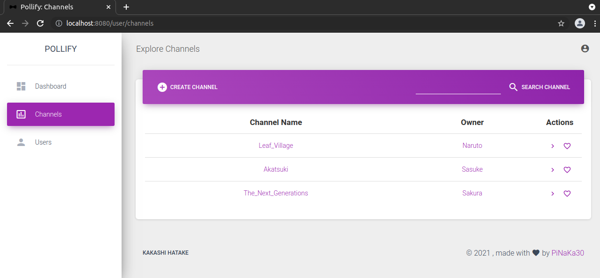
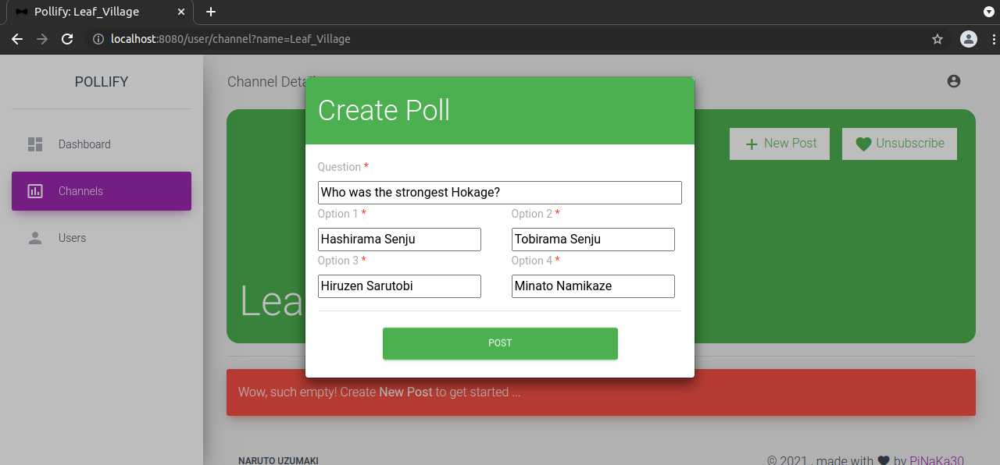
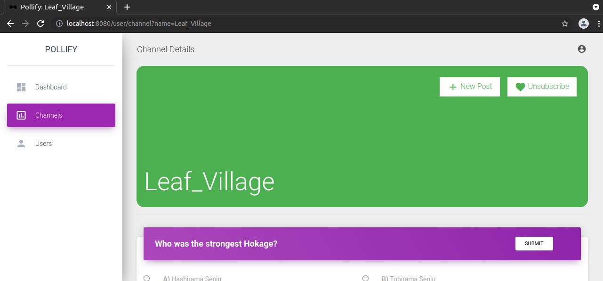

# Pollify
An app for conducting polls built using `Java (Spring-Boot)`, `Maven`, `JSP`, `Hibernate` and `MySQL`.
  

## Index 
1. [Features](#features)
2. [Deployment](#deployment)
   - [Docker build](#docker-build)
   - [Manual build](#manual-build)
3. [Screenshots](#screenshots)

## Features

- User login/register
- Create/View channels for dedicated topics
- Create/View posts in subscribed channels
- Search users by name or username
- Search channels by name
- View all posts by a user
- View all posts in a channel

## Deployment
The two ways to deploy and run/test the application are listed below:

### Docker build
This build uses `docker-compose` to run the latest images of `pollify` and `mysql`. The images are pulled from `Docker Hub`, if not present.

1. Navigate to *docker* folder from root directory.
2. Edit the environment variables in `.env` file, if required.
3. Run `docker-compose up`. Add `sudo` if required.
4. Open the browser and navigate to the port specified in `.env` file as `PORT_SERVER`.

### Manual build
This build runs the `Spring-Boot` project as a `Java` application and connects it externally to a `MySQL` instance. 

1. Navigate to *app* folder from root directory.
2. Edit the `pom.xml` file to change the field `packaging` (Line 17) from `war` to `jar`.
3. Navigate to *src/main/resources/* and edit the file named `application.properties`. 
4. Replace the values of `spring.datasource.username` and `spring.datasource.password` with your username and password.
5. Configure your `MySQL` instance to grant permissions to your user, if required.
6. Navigate to *app* folder from root directory and run `mvn clean package`.
7. A new directory named *target* will be created.
8. Run `java -jar pollify-0.0.1-SNAPSHOT.jar` from a terminal by navigating inside *target* folder.
9. Open the browser and navigate to `localhost:8080`.

## Screenshots

| | |
|:-------------------------:|:-------------------------:|
| | |
| | |
| | |
| | |
